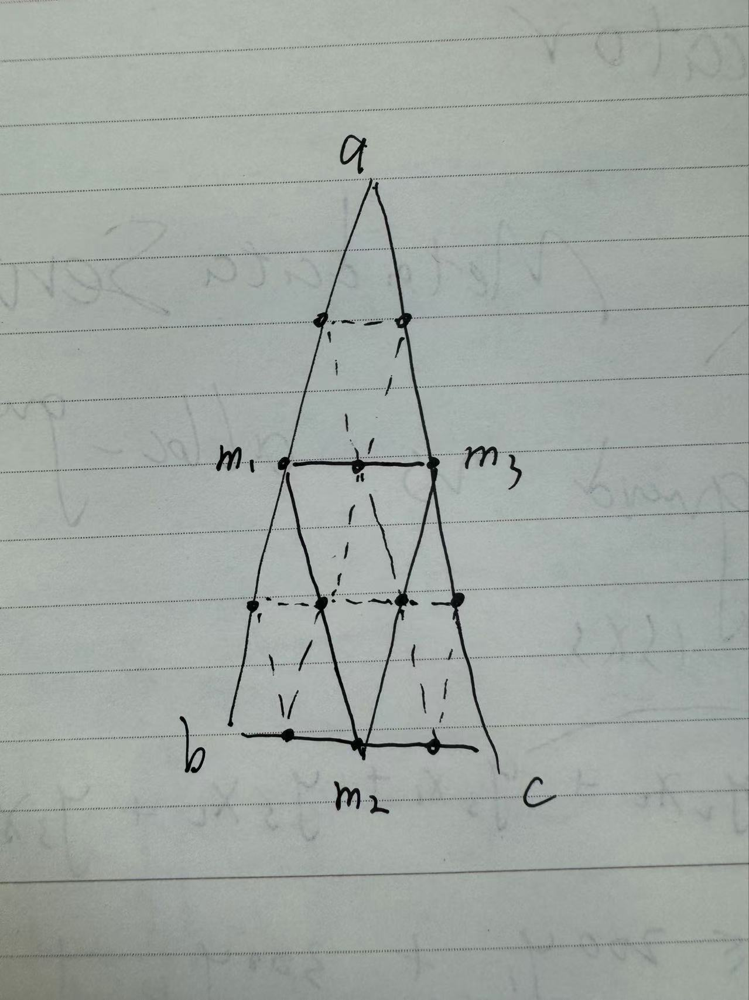

# 作业报告

## 1. 键盘与鼠标操作

- Esc: 退出，关闭窗口
- F: 画风车
- C：改变风车颜色
- S：控制风车是否旋转
- E: 控制是否下雪
- L： 控制树上彩灯是否亮起
- 鼠标移动：改变相机视角
- 鼠标滚轮：缩放

## 2. 地形模型生成

地形的实现借鉴的实例教程，但方法上有所不同。
原教程通过正方形网格细分，计正方形中点为m，四个顶点为a,b,c,d，则有
$$m = (a+b+c+d)/4 + random(-height,height)$$
$$height = height * ratio$$
height是高度的随机范围，每一次迭代不断减小。  

由于地形是圆形，所以我将圆等分为360份三角形，对于每一个三角形单独处理：
计三角形三个顶点为a,b,c，三条边的中点为m1,m2,m3，有
$$m1 = (a+b)/2 + random(-height,height)$$
$$m2 = (b+c)/2 + random(-height,height)$$
$$m3 = (c+a)/2 + random(-height,height)$$
$$height = height * ratio$$
然后连接m1,m2,m3，将三角形分为四个小三角形，递归处理。  

## 3. 地形纹理

地形的纹理我准备了4张贴图。  
在片段着色器中进行处理。比较地形点的高度与设定好的阈值，根据高度的不同选择不同的纹理。  如果位于两个纹理之间，通过线性插值的方式获得纹理颜色。

## 4. 地台模型生成

地台的生成是通过绘制一个圆柱体实现的。
我把圆柱体沿圆周分为60份，每份上下面各两个顶点，组成一个矩形。可以拆成两个三角形。  

## 5. 物理系统与碰撞检测

我实现了一个简单的物理系统。  
每一次循环，物理系统遍历所有的刚体，对所有的物体进行位置更新，并且检测碰撞，最后绘制图形。  

刚体类有位置，速度，加速度等属性，用于控制位置。它也包含一个Model，用于绘制图形。collisionBox是碰撞检测箱。

### update

刚体的位置更新是通过欧拉法实现的。
$$v = v + a * dt$$
$$x = x + v * dt$$
然后设置碰撞箱以及模型的位置。

### collision

刚体类维护两个数组：collisionLayer与collisionMask。前者是自己的碰撞层，后者是可以碰撞的层。  

碰撞检测过程：遍历每一个刚体，遍历该刚体的collisionMask，检测在collisionLayMask上的刚体是否与该刚体碰撞。

碰撞检测实现：碰撞箱继承于Shape类，isIntersect函数用于检测两个图形是否相交。

由于雪粒子大小远小于圣诞树以及地形，所以使用的是点碰撞箱。
地形选用圆柱碰撞箱，圣诞树选用圆锥碰撞箱。
为了简化实现，当前实现只需要判断雪粒子的点是否在圆锥/圆柱内。

## 6. 雪粒子运动

粒子继承自RigidBody类，特有的属性：生命周期，大小的衰减，颜色的衰减。  
当粒子生命周期结束/发生碰撞时，将其从粒子系统中移除。  

我实现了一个粒子发射器类，用于发射粒子。它设置了粒子的初始属性：

- 发射位置：点发射，圆形内的随机位置，等等
- 发射速度（和浮动），发射方向，加速度
- 发射频率
- ...
  
在雪粒子系统中，雪花的加速度我设为0，雪花的初始位置是地台上方的圆形区域，发射频率为0.01f，发射速度为0.02f，发射方向为向下。

当雪花碰到地形/圣诞树时，将其移除。

## 7. 彩灯点亮

彩灯的亮起是通过设置shader来实现的。  
我通过blender获得了圣诞树模型的材质信息，即彩灯的漫反射贴图颜色。  
我在modelShader中添加判断逻辑：若当前的漫反射颜色与给定值相等，则执行逻辑：
`result = ambient * 2.0 + diffuse + specular * 2.0;`
增大ambient（环境光）即相当于给予物体本身的光亮，看上去就像物体在发光。

## 8. 光粒子特效

光粒子复用了粒子系统。
我将光粒子设置为在圣诞树顶端以球形为范围向四周喷出，达到好像在发光的效果。
通过增加粒子的数量，减少粒子的寿命来实现。
我设置了粒子的大小衰减，光粒子的大小会不断减少，最后消失，以达到光线逐渐消失的效果。  

我在圣诞树顶端添加了第二个光源，光线设置为红色，用以渲染喷出光粒子的颜色。

